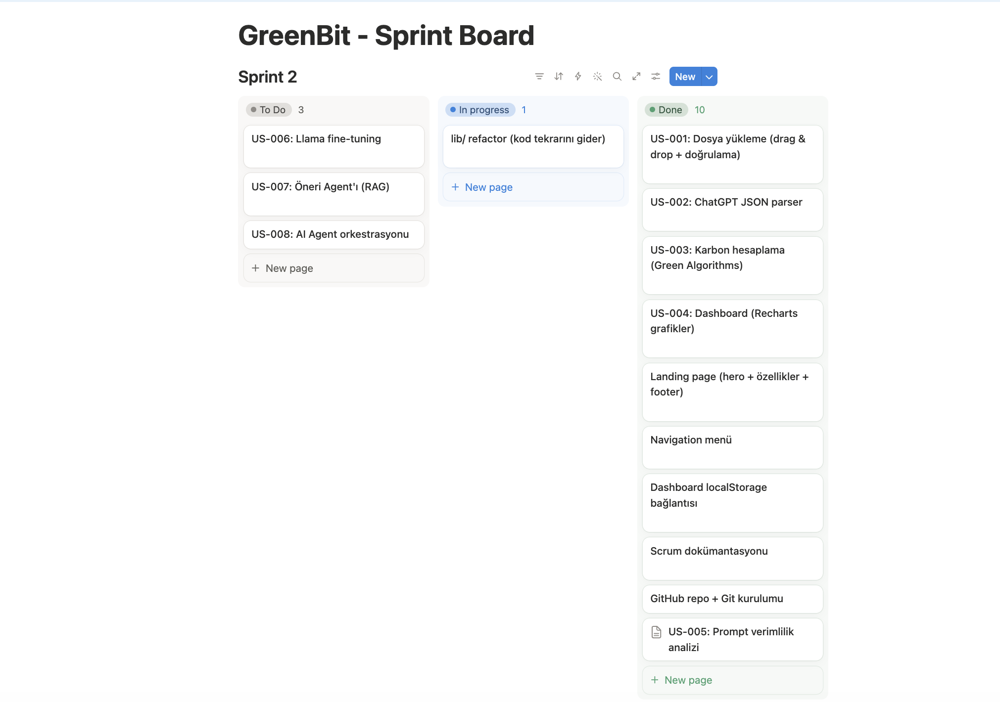
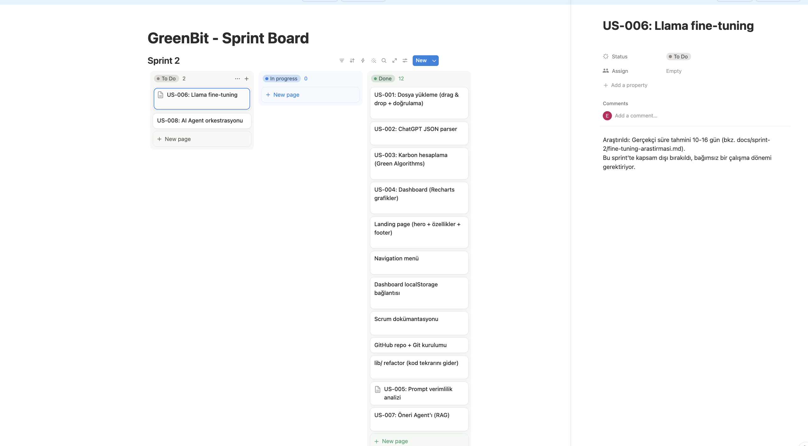
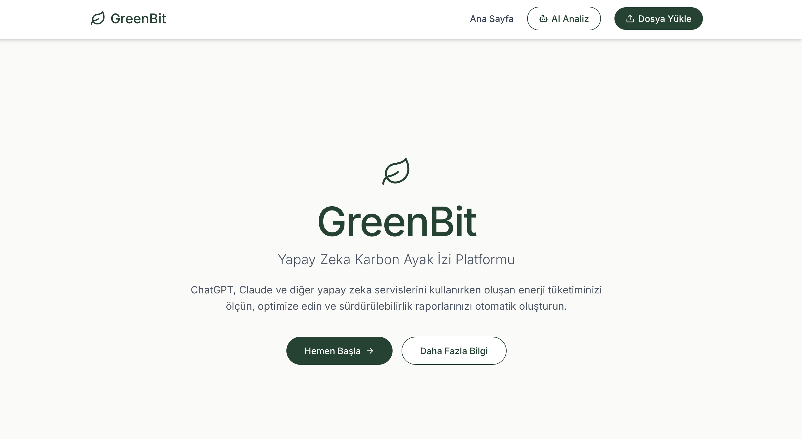
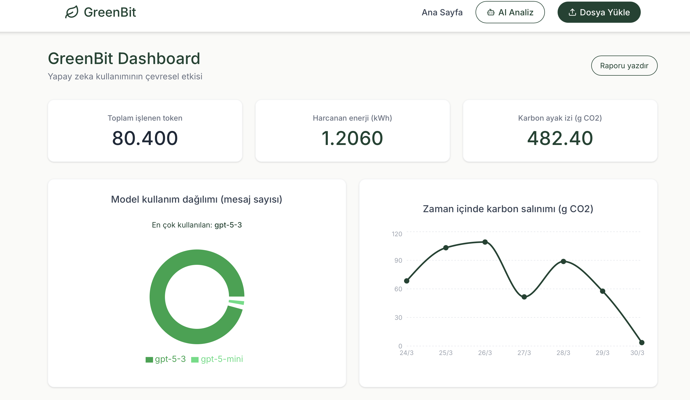
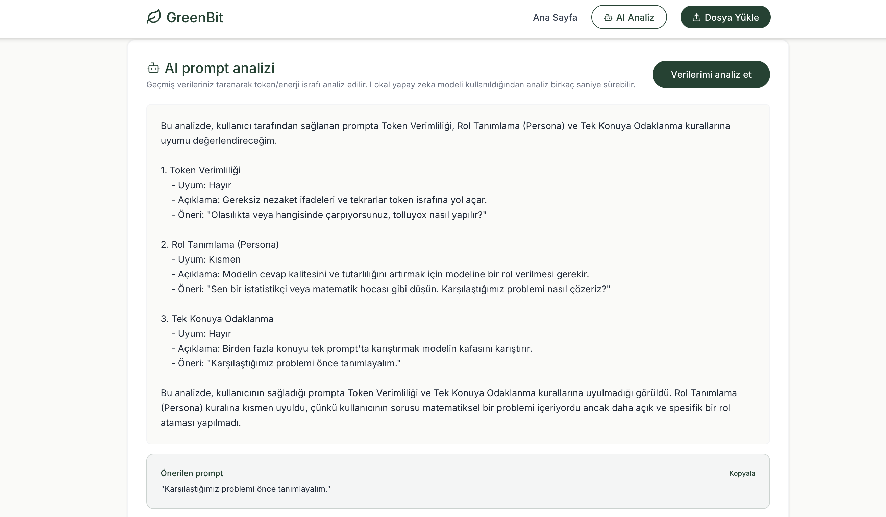

# GreenBit

**AI Karbon Ayak İzi & Prompt Verimlilik Platformu**

Yapay Zeka ve Teknoloji Akademisi 2026 Bootcamp Projesi — Yapay Zeka & Veri Bilimi Kategorisi

## Proje Hakkında

GreenBit, yapay zeka kullanımının enerji ve karbon ayak izini ölçen, optimize eden ve raporlayan AI destekli bir platformdur. Kullanıcılar ChatGPT gibi servislerden indirdikleri kullanım verilerini yükler; GreenBit bu veriyi analiz ederek hem sayısal metrikler hem de lokal bir yapay zeka (Llama 3) aracılığıyla prompt verimlilik önerileri sunar.

### Üç Temel Değer

- **Ölçüm:** Token, kWh, CO2 takibi ve zaman içindeki değişimin görselleştirilmesi
- **Prompt Koçluğu:** Lokal Llama 3 modeli ile prompt'ların açıklık, uzunluk ve verimlilik açısından analiz edilmesi (RAG destekli)
- **Gizlilik Odaklı Mimari:** Dosyalar sunucuya gönderilmez, hesaplamalar ve yapay zeka analizi tarayıcı/lokal ortamda yapılır

## Takım

| Rol | İsim |
|---|---|
| Product Owner | Ege Mert Kaya |
| Scrum Master | Ege Mert Kaya |
| Developer | Ege Mert Kaya |

> Bu proje, ekip üyelerine ulaşılamaması nedeniyle bireysel olarak yürütülmektedir.

---

## Teknoloji Yığını

- **Frontend:** Next.js (App Router), TypeScript, Tailwind CSS, Recharts, lucide-react
- **Backend:** Next.js API Routes
- **AI:** Ollama + Llama 3.1 (8B, lokal çalışan LLM), basitleştirilmiş RAG mimarisi
- **Veri Akışı:** Client-side JSON parsing, localStorage (sunucu tarafı veri saklama yok)

### Lokal Çalıştırma (AI özelliği için)

```bash
ollama pull llama3.1
```
Uygulama çalışırken Ollama'nın arka planda açık olması gerekir (`localhost:11434`).

---

## 1. Backlog Dağıtma Mantığı

Bu proje tek kişi tarafından yürütüldüğü için önceliklendirme, **"önce çalışan bir temel, sonra üzerine değer katma"** prensibiyle yapıldı.

**Sprint 1 — Çalışan MVP (Temel):** Önce ürünün iskeleti kuruldu: dosya yükleme (US-001) → parse (US-002) → karbon hesaplama (US-003) → dashboard görselleştirme (US-004). Teknik bağımlılık bunu gerektirdi — parse olmadan hesaplama, hesaplama olmadan dashboard olamaz.

**Sprint 2 — Yapay Zeka Katmanı (Değer):** Temel çalıştıktan sonra, projeyi öne çıkaracak AI özellikleri planlandı: prompt analizi (US-005), fine-tuning (US-006), RAG (US-007), agent orkestrasyonu (US-008). Sprint ortasında final sunumunun yalnızca ilk 10 projeye yapılacağı öğrenilince, öncelik **çalışan özelliklerin sağlamlaştırılmasına** kaydırıldı; fine-tuning ve agent orkestrasyonu bilinçli olarak ertelendi (detay: [Product Backlog](docs/product-backlog.md), [Fine-tuning Araştırması](docs/sprint-2/fine-tuning-arastirmasi.md)).

**Sprint 3 — Cila ve Teslim:** Sohbet arayüzü, PDF rapor, deploy, demo video.

**Önceliklendirme kriterleri:** (1) Teknik bağımlılık, (2) Değer zinciri, (3) Puan ağırlığı.

 Tam backlog: [docs/product-backlog.md](docs/product-backlog.md)

---

## 2. Daily Scrum Notları

Sprint boyunca düzenli olarak ilerleme kaydedilmiştir. Farklı günlerden öne çıkan notlar:

<details>
<summary><strong>10 Temmuz 2026 — lib/ Refactor Başlangıcı</strong></summary>

lib/ refactor tamamlandı: dashboard, upload ve parser artık `lib/carbon.ts` ve `lib/parsers/chatgpt.ts` üzerinden tek merkezden besleniyor. Kod tekrarı giderildi, upload ve dashboard arasındaki hesaplama tutarsızlığı da bu sırada tespit edilip düzeltildi. Ollama ve Llama 3 kavramları öğrenildi, lokal ortamda test edildi.

</details>

<details>
<summary><strong>11 Temmuz 2026 — İlk Backend ve AI Entegrasyonu</strong></summary>

İlk backend parçası (`api/analyze/route.ts`) oluşturuldu. Sistem promptu ile Llama, genel amaçlı asistandan "prompt analiz uzmanı"na dönüştürüldü. Türkçe çıktı kalitesi için model `llama3.2` (3B) yerine `llama3.1` (8B) olarak güncellendi. Analiz, Dashboard'a gömülü bir panel olarak entegre edildi.

</details>

<details>
<summary><strong>16 Temmuz 2026 — RAG Tamamlandı, Fine-Tuning Araştırıldı</strong></summary>

Basitleştirilmiş bir RAG mimarisi kuruldu: yapılandırılmış prompt kuralları deposu + retrieval mekanizması. Fine-tuning süreci araştırıldı, gerçekçi süre tahmini (10-16 gün) çıkarılıp bu sprint kapsamı dışında bırakılmasına karar verildi.

</details>

<details>
<summary><strong>17 Temmuz 2026 — Bug Düzeltmeleri ve Tasarım Yenileme</strong></summary>

Kritik bir bug (dashboard'da sonsuz "Yükleniyor..." durumu) tespit edilip düzeltildi. Responsive/mobil tasarım sorunları giderildi. Edge case testleri (geçersiz dosya formatı, uyumsuz JSON) yapıldı. Proje genelinde tutarlı bir tasarım dili uygulandı: özel renk paleti, Inter font, lucide-react ikonları — tüm sayfalar yeniden tasarlandı. AI analiz çıktı kalitesi, sabit yanıt formatı ile önemli ölçüde iyileştirildi.

</details>

<details>
<summary><strong>18-19 Temmuz 2026 — Belgeleme ve Kapanış</strong></summary>

Sprint 2 dokümantasyonu (Review, Retrospective, Board, Backlog) son haliyle güncellendi. Küçük ek özellikler (rapor yazdırma, en çok kullanılan model rozeti) eklendi. README, teslim gereksinimlerine göre yeniden yapılandırıldı.

</details>

 Tam günlük kayıtlar: [Sprint 1](docs/sprint-1/daily-scrum-notes.md) · [Sprint 2](docs/sprint-2/daily-scrum-notes.md)

---

## 3. Sprint Board Güncellemeleri

Canlı board: **[Notion Sprint Board](https://great-colony-435.notion.site/GreenBit-Sprint-Board-398dd1e285178028bf86e87825e031e8)**

Farklı günlerden alınan durum görüntüleri, board'daki task akışını gösterir:

**Sprint 1 sonu:**


**Sprint 2 ortası:**


**Sprint 2 sonu:**


---

## 4. Ürün Durumu

Sprint 2 sonunda ulaşılan, çalışan ve test edilmiş en kararlı hâl:

**Ana Sayfa:**


**Dashboard (Grafikler + AI Analiz Paneli):**


**AI Prompt Analizi (Öneri Kutusu):**


Ürün; dosya yükleme, karbon/enerji hesaplama, görselleştirme ve lokal yapay zeka destekli prompt analizini uçtan uca çalışır durumda sunmaktadır.

---

## 5. Sprint Review

Sprint 2'nin temel ve orta katman hedefleri (lib refactor, Llama entegrasyonu, prompt analizi, RAG) eksiksiz tamamlanmış; ayrıca planlanmamış bir kalite/tasarım iyileştirme çalışması yürütülmüştür. İleri katman (fine-tuning, agent orkestrasyonu) araştırılmış, gerekçeli biçimde ertelenmiştir.

<details>
<summary><strong>Tam Sprint Review içeriğini görüntüle</strong></summary>

 [docs/sprint-2/sprint-review.md](docs/sprint-2/sprint-review.md) dosyasında tamamlanan/ertelenen işlerin tam listesi, gösterilebilir çıktı tanımı ve gerekçeler yer almaktadır.

</details>

---

## 6. Sprint Retrospective

**İyi gidenler:** Refactor disiplini, kademeli AI entegrasyonu (basitten karmaşığa), UX'e duyarlılık, strateji esnekliği.
**Zorlanılanlar:** Model seçimi (3B → 8B geçişi), import yolu hataları, paralel çalışma ortamı karmaşası.
**Aksiyon maddeleri:** Tek çalışma ortamına odaklanma, yeni özellik eklemeden önce küçük ölçekli test, Sprint 3'te agent orkestrasyonuna geçiş.

<details>
<summary><strong>Tam Retrospective içeriğini görüntüle</strong></summary>

 [docs/sprint-2/sprint-retrospective.md](docs/sprint-2/sprint-retrospective.md)

</details>

---

## Sprint Takvimi

| Sprint | Tarih | Hedef |
|---|---|---|
| Sprint 1 | 19 Haz – 5 Tem | Temel altyapı, dosya yükleme, karbon hesaplama, MVP dashboard |
| Sprint 2 | 6 – 19 Tem | Kod tekrarının giderilmesi, Llama 3 entegrasyonu, RAG, prompt verimlilik analizi |
| Sprint 3 | 20 Tem – 2 Ağu | Sohbet arayüzü, PDF rapor, deploy, demo video |

---

## Tüm Belgeler

- [Product Backlog](docs/product-backlog.md)
- **Sprint 1:** [Planning](docs/sprint-1/sprint-planning.md) · [Board](docs/sprint-1/sprint-board.md) · [Daily Notes](docs/sprint-1/daily-scrum-notes.md) · [Review](docs/sprint-1/sprint-review.md) · [Retrospective](docs/sprint-1/sprint-retrospective.md)
- **Sprint 2:** [Planning](docs/sprint-2/sprint-planning.md) · [Board](docs/sprint-2/sprint-board.md) · [Daily Notes](docs/sprint-2/daily-scrum-notes.md) · [Review](docs/sprint-2/sprint-review.md) · [Retrospective](docs/sprint-2/sprint-retrospective.md) · [Fine-tuning Araştırması](docs/sprint-2/fine-tuning-arastirmasi.md)

---

## Katkı ve Kullanım Notu

Bu proje, Yapay Zeka ve Teknoloji Akademisi 2026 Bootcamp kapsamında geliştirilmiştir. MIT lisansıyla açık kaynak olarak paylaşılmaktadır; kod incelemesi, öğrenme ve katkı amacıyla serbestçe kullanılabilir. Geliştirme sürecinin özgün kaydı commit geçmişinde saklanmaktadır.

## Lisans

MIT License