# GreenBit

**AI Karbon Ayak İzi & Prompt Verimlilik Platformu**

**Canlı Site:** [green-bit-seven.vercel.app](https://green-bit-seven.vercel.app)

Yapay Zeka ve Teknoloji Akademisi 2026 Bootcamp Projesi — Yapay Zeka & Veri Bilimi Kategorisi

## Proje Hakkında

GreenBit, yapay zeka kullanımının enerji ve karbon ayak izini ölçen, optimize eden ve raporlayan AI destekli bir platformdur. Kullanıcılar ChatGPT'den indirdikleri kullanım verilerini yükler; GreenBit bu veriyi analiz ederek hem sayısal metrikler hem de lokal bir yapay zeka (Llama 3) aracılığıyla prompt verimlilik önerileri sunar.

### Üç Temel Değer

- **Ölçüm:** Token, kWh, CO2 takibi ve zaman içindeki değişimin görselleştirilmesi
- **Prompt Koçluğu:** Lokal Llama 3 modeli ile prompt'ların açıklık, uzunluk ve verimlilik açısından analiz edilmesi (RAG destekli)
- **Gizlilik Odaklı Mimari:** Sayısal hesaplamalar tarayıcıda yapılır; AI analizi için yalnızca örnek promptlar API'ye iletilir, hiçbir veri saklanmaz

## Takım

**Takım 329**

| Rol | İsim |
|---|---|
| Product Owner | Ege Mert Kaya |
| Scrum Master | Ege Mert Kaya |
| Developer | Ege Mert Kaya |

> Bu proje, ekip üyelerine ulaşılamaması nedeniyle bireysel olarak yürütülmektedir.

---

## Teknoloji Yığını

- **Frontend:** Next.js (App Router), TypeScript, Tailwind CSS, Recharts, lucide-react
- **Backend:** Next.js API Routes
- **AI:** Lokal geliştirmede Ollama + Llama 3.1 (8B); canlı ortamda Groq API (openai/gpt-oss-120b) — ortak bir `callLLM` fonksiyonu, ortama göre otomatik olarak doğru servisi seçer. Basitleştirilmiş RAG mimarisi.
- **Deploy:** Vercel (hosting) + Groq (AI inference)
- **Veri Akışı:** Client-side JSON parsing, localStorage (sunucu tarafı veri saklama yok)
> **Not:** Kullanılan açık kaynak dil modeli, Türkçe çıktılarda bazen doğal olmayan ifadeler üretebiliyor. İngilizce promptlarla daha akıcı sonuçlar alınabiliyor; bu, projenin bilinen bir sınırlamasıdır.

---

## 1. Backlog Dağıtma Mantığı

Bu proje tek kişi tarafından yürütüldüğü için önceliklendirme, **"önce çalışan bir temel, sonra üzerine değer katma"** prensibiyle yapıldı.

**Sprint 1 — Çalışan MVP (Temel):** Önce ürünün iskeleti kuruldu: dosya yükleme (US-001) → parse (US-002) → karbon hesaplama (US-003) → dashboard görselleştirme (US-004). Teknik bağımlılık bunu gerektirdi — parse olmadan hesaplama, hesaplama olmadan dashboard olamaz.

**Sprint 2 — Yapay Zeka Katmanı (Değer):** Temel çalıştıktan sonra, projeyi öne çıkaracak AI özellikleri planlandı: prompt analizi (US-005), fine-tuning (US-006), RAG (US-007), agent orkestrasyonu (US-008). Sprint ortasında final sunumunun yalnızca ilk 10 projeye yapılacağı öğrenilince, öncelik **çalışan özelliklerin sağlamlaştırılmasına** kaydırıldı; fine-tuning ve agent orkestrasyonu bilinçli olarak ertelendi (detay: [Product Backlog](docs/product-backlog.md), [Fine-tuning Araştırması](docs/sprint-2/fine-tuning-arastirmasi.md)).

**Sprint 3 — Cila ve Teslim:** Sohbet arayüzü, PDF rapor, deploy, demo video.

**Önceliklendirme kriterleri:** (1) Teknik bağımlılık, (2) Değer zinciri, (3) Puan ağırlığı.

 Tam backlog: [docs/product-backlog.md](docs/product-backlog.md)

---

## 2. Daily Scrum Notları

Sprint boyunca düzenli olarak ilerleme kaydedilmiştir. Farklı günlerden öne çıkan notlar:

<strong>10 Temmuz 2026 — lib/ Refactor Başlangıcı</strong>

lib/ refactor tamamlandı: dashboard, upload ve parser artık `lib/carbon.ts` ve `lib/parsers/chatgpt.ts` üzerinden tek merkezden besleniyor. Kod tekrarı giderildi, upload ve dashboard arasındaki hesaplama tutarsızlığı da bu sırada tespit edilip düzeltildi. Ollama ve Llama 3 kavramları öğrenildi, lokal ortamda test edildi.

<strong>11 Temmuz 2026 — İlk Backend ve AI Entegrasyonu</strong>

İlk backend parçası (`api/analyze/route.ts`) oluşturuldu. Sistem promptu ile Llama, genel amaçlı asistandan "prompt analiz uzmanı"na dönüştürüldü. Türkçe çıktı kalitesi için model `llama3.2` (3B) yerine `llama3.1` (8B) olarak güncellendi. Analiz, Dashboard'a gömülü bir panel olarak entegre edildi.

<strong>16 Temmuz 2026 — RAG Tamamlandı, Fine-Tuning Araştırıldı</strong>

Basitleştirilmiş bir RAG mimarisi kuruldu: yapılandırılmış prompt kuralları deposu + retrieval mekanizması. Fine-tuning süreci araştırıldı, gerçekçi süre tahmini (10-16 gün) çıkarılıp bu sprint kapsamı dışında bırakılmasına karar verildi.

<strong>17 Temmuz 2026 — Bug Düzeltmeleri ve Tasarım Yenileme</strong>

Kritik bir bug (dashboard'da sonsuz "Yükleniyor..." durumu) tespit edilip düzeltildi. Responsive/mobil tasarım sorunları giderildi. Edge case testleri (geçersiz dosya formatı, uyumsuz JSON) yapıldı. Proje genelinde tutarlı bir tasarım dili uygulandı: özel renk paleti, Inter font, lucide-react ikonları — tüm sayfalar yeniden tasarlandı. AI analiz çıktı kalitesi, sabit yanıt formatı ile önemli ölçüde iyileştirildi.

<strong>18-19 Temmuz 2026 — Belgeleme ve Kapanış</strong>

Sprint 2 dokümantasyonu (Review, Retrospective, Board, Backlog) son haliyle güncellendi. Küçük ek özellikler (rapor yazdırma, en çok kullanılan model rozeti) eklendi. README, teslim gereksinimlerine göre yeniden yapılandırıldı.

 Tam günlük kayıtlar: [Sprint 1](docs/sprint-1/daily-scrum-notes.md) · [Sprint 2](docs/sprint-2/daily-scrum-notes.md)   [Sprint 3](docs/sprint-3/daily-scrum-notes.md)

---

## 3. Sprint Board Güncellemeleri

Canlı board: **[Notion Sprint Board](https://great-colony-435.notion.site/GreenBit-Sprint-Board-398dd1e285178028bf86e87825e031e8)**

Farklı günlerden alınan durum görüntüleri, board'daki task akışını gösterir:

**Sprint 1 sonu:**
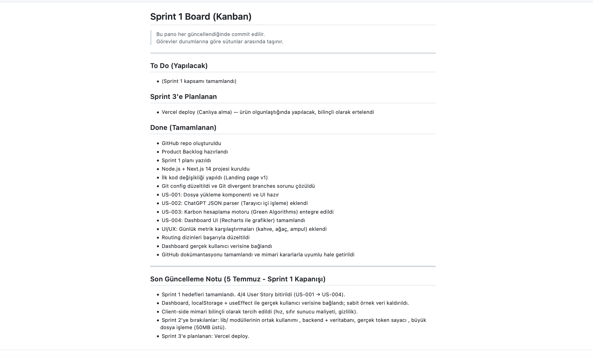

**Sprint 2 ortası:**
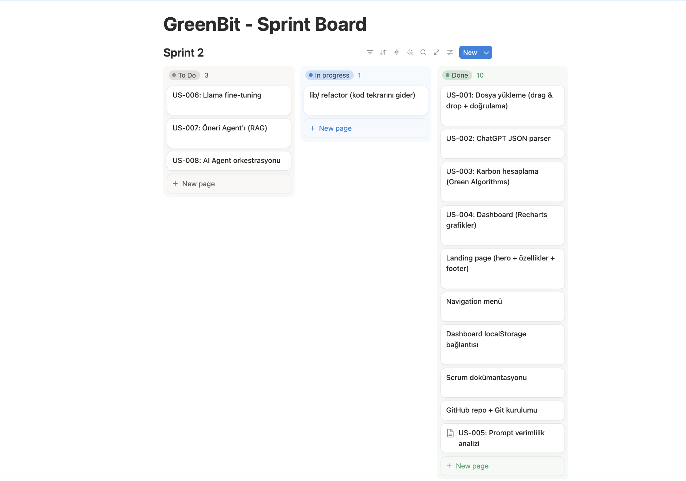

**Sprint 2 sonu:**
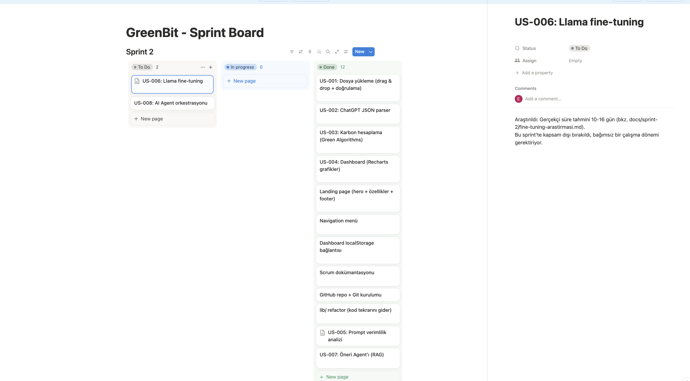

**Sprint 3(Final) sonu:**
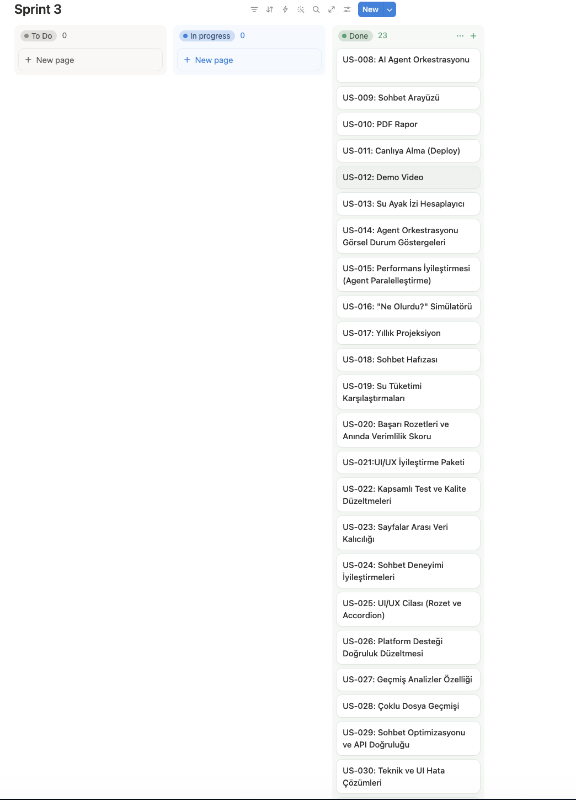

---

## 4. Ürün Durumu

Geliştirme sürecinin sonlanmasıyla birlikte uygulama; dosya yüklemeden yapay zeka analizine kadar hedeflenen ana akışı başarıyla tamamlamıştır. Projenin güncel arayüzleri aşağıdadır:

**Ana Sayfa (Landing Page)**
> Projenin amacını, temel değer önerisini ve platform destek durumunu sunan giriş ekranı.
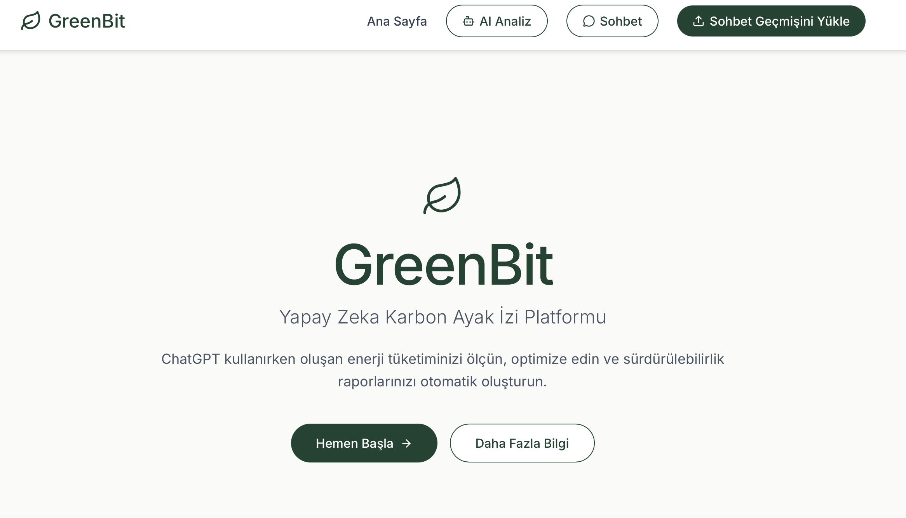

**Veri Yükleme ve Anlık Analiz (Upload & Results)**
> Kullanıcının ChatGPT `conversations.json` verisini yüklediği, tarayıcıda işlenen verilerin karbon, enerji ve su ayak izi eşdeğerlerine dönüştürüldüğü sonuç ekranı.
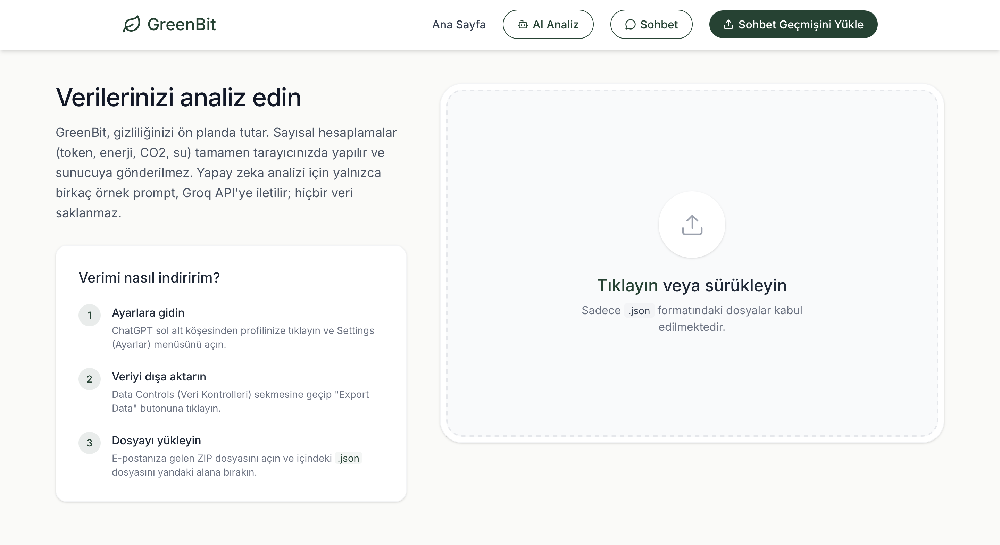
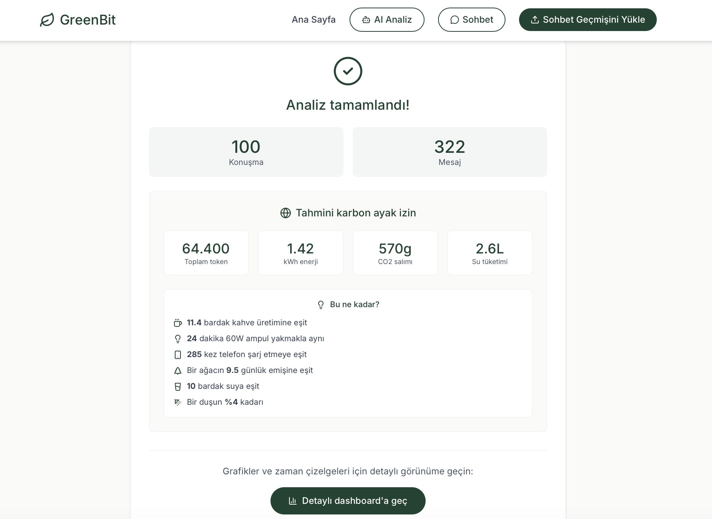

**Dashboard: Veri Görselleştirme ve Tasarruf Simülasyonu**
> Model kullanım dağılımları, zaman içindeki karbon trendleri, "Ne Olurdu?" tasarruf simülasyonu ve kazanılan başarı rozetlerini barındıran kontrol paneli.
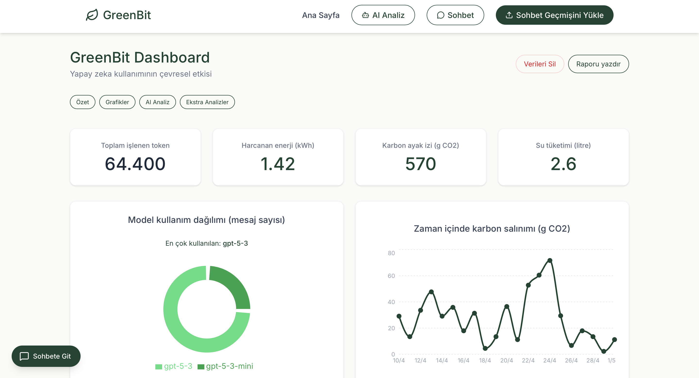
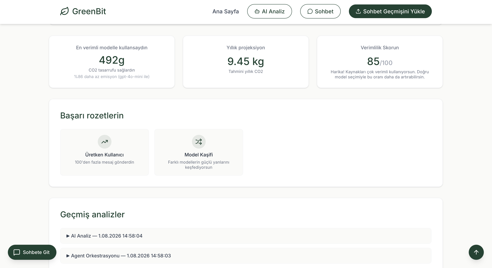

**Yapay Zeka (AI) Analiz ve Prompt Test Ekranı**
> Kullanıcının mevcut promptlarının verimlilik açısından değerlendirildiği, uyumluluk rozetlerinin verildiği ve yeni prompt testlerinin yapılabildiği analiz arayüzü.
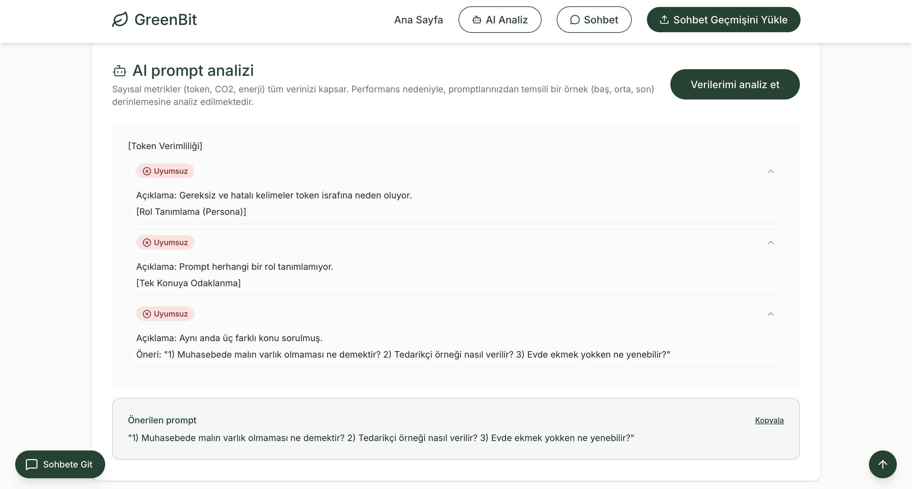
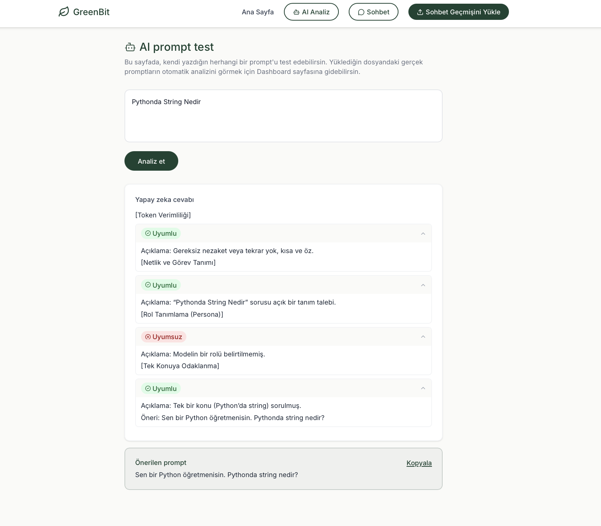

**AI Agent Orkestrasyonu**
> Arka planda paralel olarak çalışan ve üç farklı analiz görevini (prompt verimliliği, model önerisi, skorlama) koordine eden agent sisteminin durum ekranı.
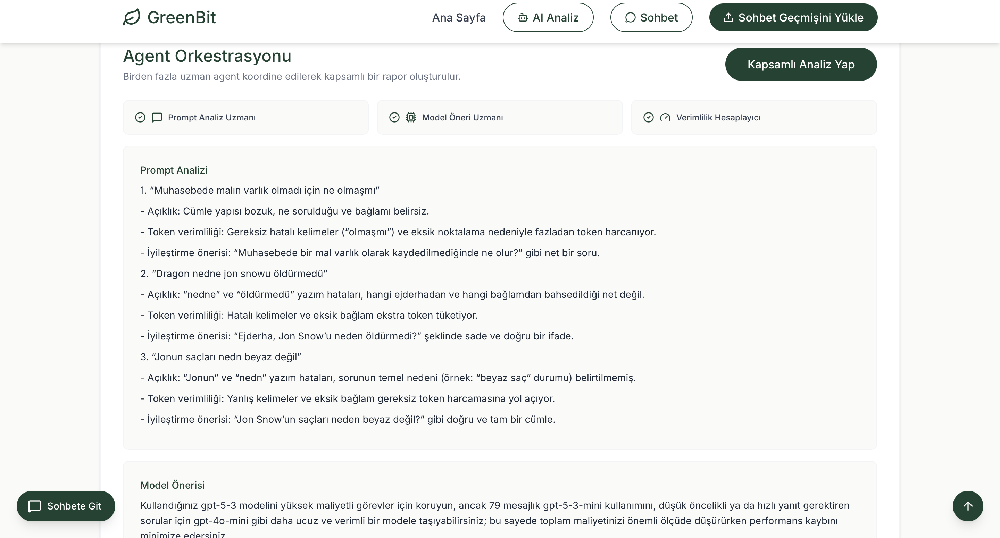

**Doğal Dil Sohbet Arayüzü (Chat)**
> Kullanıcının tamamen kendi yüklediği veriler üzerinden RAG benzeri bir yapıyla yapay zekaya sorular sorabildiği, hafızalı sohbet ekranı.
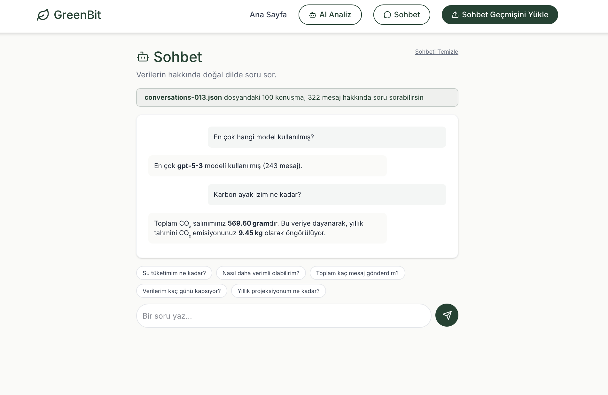

---

## Hedef Kitle

- Yapay zekayı düzenli kullanan ve çevresel etkisini merak eden bireysel kullanıcılar
- Sürdürülebilirlik bilinci yüksek öğrenciler ve teknoloji profesyonelleri
- Kurumsal yapay zeka kullanım maliyetini ve çevresel etkisini raporlamak isteyen ekipler

---
## Nasıl Çalışır?

1. **Veri Yükleme:** ChatGPT'den indirdiğiniz JSON dosyasını platforma yükleyin.
2. **Analiz:** Token, enerji (kWh), CO2 ve su tüketimi tarayıcınızda anında hesaplanır.
3. **Dashboard:** Grafikler, karşılaştırmalar ve verimlilik skorunuzu görün.
4. **AI Koçluk:** Yapay zeka, promptlarınızı analiz edip iyileştirme önerileri sunar.
5. **Sohbet:** Verileriniz hakkında doğal dilde soru sorun.
---
## 5. Sprint Review

Sprint 3 itibarıyla ürün, çalışan bir prototipten canlı, kullanıcı testinden geçmiş bir platforma dönüştürülmüştür.

<strong>Tam Sprint Review içeriğini görüntüle</strong>

 [docs/sprint-3/sprint-review.md](docs/sprint-3/sprint-review.md) dosyasında tamamlanan/ertelenen işlerin tam listesi, gösterilebilir çıktı tanımı ve gerekçeler yer almaktadır.

---

## 6. Sprint Retrospective

**İyi gidenler:** Agent Orkestrasyonu ve Sohbet Arayüzünün beklenenden hızlı tamamlanması, yeni özellik ekleme hırsına kapılmadan test günlerine ayrılan zaman, loglara dayalı sistematik debug.
**Zorlanılanlar:** İstemci tarafında büyük JSON dosyalarını tutarken tarayıcının localStorage 5MB limitine (QuotaExceededError) takılmak, React hydration hataları.
**Aksiyon maddeleri:** Süreç boyunca geliştirilen esnek kapsam yönetimi (scope control) becerisinin ve tarayıcı kısıtlamalarına dair alınan derslerin sonraki projelere aktarılması

<strong>Tam Retrospective içeriğini görüntüle</strong>

 [docs/sprint-3/sprint-retrospective.md](docs/sprint-3/sprint-retrospective.md)

---

## 7. Sprint 3 — Cila, Deploy ve Teslim

Sprint 3'te, ürün "çalışan bir prototip"ten **canlı, kullanıcı testinden geçmiş bir platforma** dönüştürüldü.

### Öne Çıkanlar

- **Agent Orkestrasyonu (US-008):** Prompt analiz, model önerisi ve verimlilik skorunu koordine eden bir sistem; paralel API çağrılarıyla hızlandırıldı.
- **Sohbet Arayüzü (US-009):** Kullanıcı verisiyle bağlantılı, hafızalı, örnek soru önerili bir sohbet deneyimi.
- **Bonus özellikler:** Su Ayak İzi Hesaplayıcı, "Ne Olurdu?" Simülatörü, Yıllık Projeksiyon, Başarı Rozetleri, Anında Verimlilik Skoru, Geçmiş Analizler.
- **US-011: Deploy.** Oracle Cloud'da kapasite sorunu yaşandı; Groq API + Vercel'e geçildi. Site canlıda, güvenlik kontrolü ve performans izleme (Analytics/Speed Insights) ile birlikte.
- **Kapsamlı test ve kalite düzeltmeleri:** Harici bir UX/UI raporu ve kullanıcı testleri doğrultusunda; sayfalar arası veri kalıcılığı, rozet/accordion tasarımı gibi önemli iyileştirmeler yapıldı.

### Bilinçli Kapsam Kararları

Geliştirme sürecinin sonlarında "Çoklu dosya yönetimi" gibi büyük bir özellik isteği test edilmiş, ancak büyük veri setlerinde tarayıcı localStorage 5MB limitine takıldığı (QuotaExceededError) tespit edilmiştir. İnatla hatalı bir mimariyi canlıya taşımak yerine, kapsam bilinçli olarak küçültülerek bu özellik iptal edilmiş ve uygulamanın stabilizasyonu güvenceye alınmıştır. Bu karar, sağlam bir ürün yönetimi (Product Management) prensibi örneğidir.

 Tam detaylar: [docs/sprint-3/daily-scrum-notes.md](docs/sprint-3/daily-scrum-notes.md) · [Sprint Review](docs/sprint-3/sprint-review.md) · [Sprint Retrospective](docs/sprint-3/sprint-retrospective.md) · [Sprint Board](docs/sprint-3/sprint-board.md)

---

| Sprint | Tarih | Hedef | Durum |
|---|---|---|---|
| Sprint 1 | 19 Haz – 5 Tem | Temel altyapı, dosya yükleme, karbon hesaplama, MVP dashboard |  Tamamlandı |
| Sprint 2 | 6 – 19 Tem | Kod tekrarının giderilmesi, Llama 3 entegrasyonu, RAG, prompt verimlilik analizi |  Tamamlandı (6/6) |
| Sprint 3 | 20 Tem – 2 Ağu | Sohbet arayüzü, PDF rapor, deploy, demo video |  Tamamlandı |
---

## Tüm Belgeler

- [Product Backlog](docs/product-backlog.md)

- **Sprint 1:** [Planning](docs/sprint-1/sprint-planning.md) · [Board](docs/sprint-1/sprint-board.md) · [Daily Notes](docs/sprint-1/daily-scrum-notes.md) · [Review](docs/sprint-1/sprint-review.md) · [Retrospective](docs/sprint-1/sprint-retrospective.md)

- **Sprint 2:** [Planning](docs/sprint-2/sprint-planning.md) · [Board](docs/sprint-2/sprint-board.md) · [Daily Notes](docs/sprint-2/daily-scrum-notes.md) · [Review](docs/sprint-2/sprint-review.md) · [Retrospective](docs/sprint-2/sprint-retrospective.md) · [Fine-tuning Araştırması](docs/sprint-2/fine-tuning-arastirmasi.md)

- **Sprint 3:** [Planning](docs/sprint-3/sprint-planning.md) · [Board](docs/sprint-3/sprint-board.md) · [Daily Notes](docs/sprint-3/daily-scrum-notes.md) · [Review](docs/sprint-3/sprint-review.md) · [Retrospective](docs/sprint-3/sprint-retrospective.md) 

---

## Katkı ve Kullanım Notu

Bu proje, Yapay Zeka ve Teknoloji Akademisi 2026 Bootcamp kapsamında geliştirilmiştir. MIT lisansıyla açık kaynak olarak paylaşılmaktadır; kod incelemesi, öğrenme ve katkı amacıyla serbestçe kullanılabilir. Geliştirme sürecinin özgün kaydı commit geçmişinde saklanmaktadır.

## Lisans

MIT License