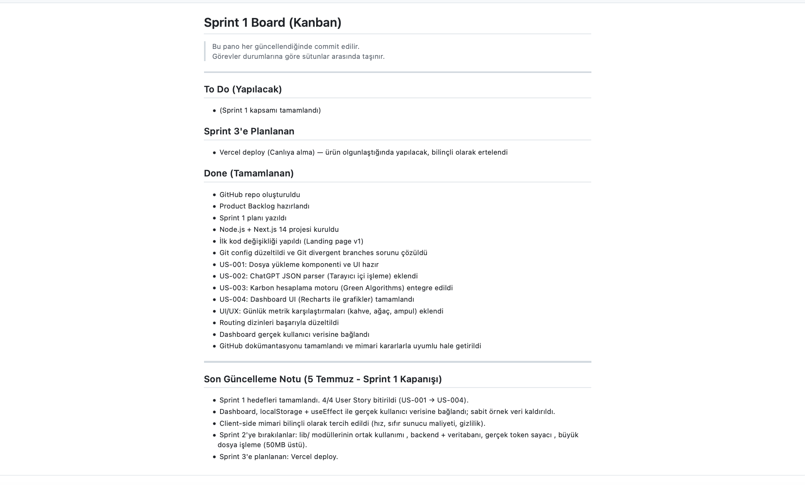

#  Sprint 1 Board (Kanban)

> Bu pano her güncellendiğinde commit edilir.  
> Görevler durumlarına göre sütunlar arasında taşınır.

---

##  To Do (Yapılacak)
- (Sprint 1 kapsamı tamamlandı)

##   Sprint 3'e Planlanan
- Vercel deploy (Canlıya alma) — ürün olgunlaştığında yapılacak, bilinçli olarak ertelendi

##  Done (Tamamlanan)
- GitHub repo oluşturuldu
- Product Backlog hazırlandı
- Sprint 1 planı yazıldı
- Node.js + Next.js 14 projesi kuruldu
- İlk kod değişikliği yapıldı (Landing page v1)
- Git config düzeltildi ve Git divergent branches sorunu çözüldü
- US-001: Dosya yükleme komponenti ve UI hazır
- US-002: ChatGPT JSON parser (Tarayıcı içi işleme) eklendi
- US-003: Karbon hesaplama motoru (Green Algorithms) entegre edildi
- US-004: Dashboard UI (Recharts ile grafikler) tamamlandı
- UI/UX: Günlük metrik karşılaştırmaları (kahve, ağaç, ampul) eklendi
- Routing dizinleri başarıyla düzeltildi
- Dashboard gerçek kullanıcı verisine bağlandı
- GitHub dokümantasyonu tamamlandı ve mimari kararlarla uyumlu hale getirildi

---
##  Son Güncelleme Notu (5 Temmuz - Sprint 1 Kapanışı)
- Sprint 1 hedefleri tamamlandı. 4/4 User Story bitirildi (US-001 → US-004).
- Dashboard, localStorage + useEffect ile gerçek kullanıcı verisine bağlandı; sabit örnek veri kaldırıldı.
- Client-side mimari bilinçli olarak tercih edildi (hız, sıfır sunucu maliyeti, gizlilik).
- Sprint 2'ye bırakılanlar: lib/ modüllerinin ortak kullanımı , backend + veritabanı, gerçek token sayacı , büyük dosya işleme (50MB üstü).
- Sprint 3'e planlanan: Vercel deploy.